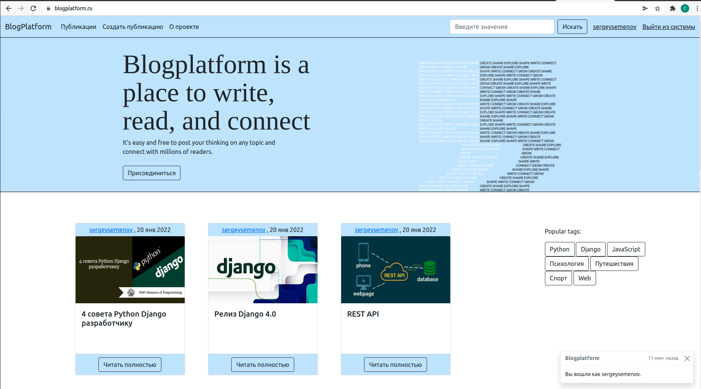

# blogplatform

A blog with the functionality of registering, creating, editing and deleting a publication,
linking publications to tags and blogs, managing your profile, subscribing to other authors.

Written in django, database - postgresql, cache - memcached, celery for pending tasks, e.g. sending email, broker - redis, bootstrap styles.
